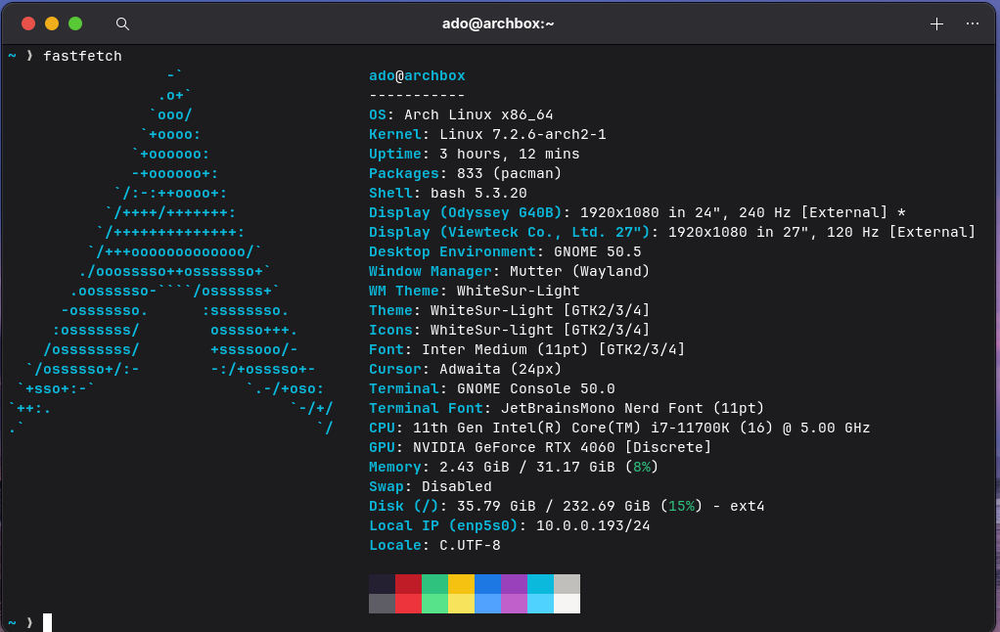

  

  Arch Linux + GNOME dotfiles, managed with <a href="https://chezmoi.io">chezmoi</a>.

### shell

- [bash](https://www.gnu.org/software/bash/) — shell
- [starship](https://starship.rs) — prompt, with Nerd Font icons
- [mise](https://mise.jdx.dev) — runtime manager (`node`, `bun`, `python`)
- [eza](https://github.com/eza-community/eza) — `ls`
- [bat](https://github.com/sharkdp/bat) — `cat` with syntax highlighting
- [fd](https://github.com/sharkdp/fd) — faster `find`
- [fzf](https://github.com/junegunn/fzf) — fuzzy finder (`ctrl+r`, `ctrl+t`)
- [zoxide](https://github.com/ajeetdsouza/zoxide) — smarter `cd`
- [yay](https://github.com/Jguer/yay) — AUR helper

### desktop

- GNOME on Wayland
- [WhiteSur](https://github.com/vinceliuice/WhiteSur-gtk-theme) GTK theme and icons, Inter UI font
- extensions: Just Perfection, Dash to Dock, Blur my Shell, Hide Top Bar, Vitals, Move Clock
- [keyd](https://github.com/rvaiya/keyd) — caps lock becomes a `wasd` arrow layer

Install and update steps: [SETUP.md](SETUP.md)
